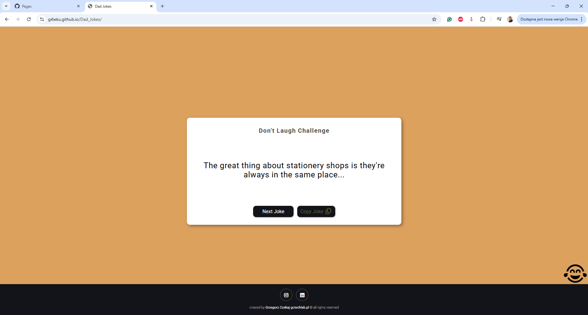

# 😂 Random Dad Joke Generator

This is a simple JavaScript project that fetches random dad jokes from the icanhazdadjoke API
and displays them on the page. It also includes a handy copy-to-clipboard feature so you can quickly share the jokes with friends.

## ✨ Features

- Fetches a new random dad joke at the click of a button
- Displays the joke dynamically in the browser
- Copy jokes directly to your clipboard with one click
- Uses the free icanhazdadjoke API

## 🛠️ How It Works

1. The "Get Joke" button triggers a function that fetches a random joke in JSON format from the API.
2. The joke is then displayed inside the #joke element.
3. The "Copy" button copies the current joke text to the clipboard using the modern navigator.clipboard API.

## 📂 Files

- index.html → Contains the structure (buttons & joke container)
- style.css → Styles for layout and design (optional/custom)
- script.js → Core logic (fetching jokes & clipboard functionality)

## 🚀 Usage

1. Open the link https://g4ieku.github.io/Dad_Jokes/ and start generating jokes instantly!
2. Click "Get Joke" to see a new random dad joke
3. Click "Copy" to copy the joke to your clipboard

## 📸 Example in Action

Joke Generator UI:

